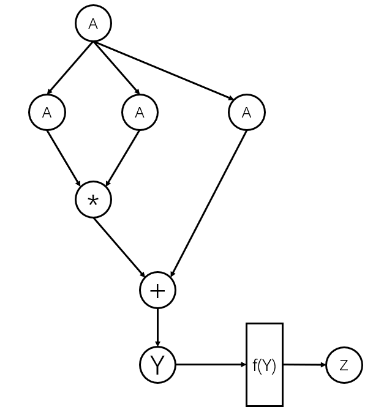

# 虚函数：实现自动求导算子基类Function
自动求导模块是现代深度学习框架的一个重要部分，它是实现反向传播算法的关键技术，其推导效率和计算效率直接决定了深度学习框架的训练和推理效率。

**反向传播算法**：反向传播算法是神经网络中的一种重要的学习算法，其主要目标是计算神经网络中权值的梯度。BP算法的关键步骤如下：

1. **前向传播**：输入样本，通过神经网络进行计算，得到预测值。
2. **计算损失**：使用损失函数（如均方误差）计算预测值与真实值之间的差距。
3. **反向传播**：计算损失函数关于每个权重和偏置的梯度。这是通过链式法则来完成的。

**链式求导**是反向传播中计算梯度的关键步骤。假设我们有一个复合函数$f(g(x))$，我们想要计算这个函数关于$x$的导数。根据链式法则，我们有：

$$\frac{df}{dx} = \frac{df}{dg} \cdot \frac{dg}{dx}$$

在神经网络中，我们通常有多个这样的复合函数，因此我们需要反复应用链式法则来计算梯度。

例如，假设我们的损失函数为$L = f(y, t)$，其中$y = g(x, w)$是神经网络的输出，$t$是目标值，$w$是权重。我们想要计算损失函数关于权重的梯度，即$\frac{dL}{dw}$。根据链式法则，我们有：

$$\frac{dL}{dw} = \frac{dL}{dy} \cdot \frac{dy}{dw}$$

这就是BP算法中链式求导的基本原理。

**自动求导模块**：自动求导模块是现代深度学习框架的一个重要的组成部分，其通过接收来自上层的梯度（比如上面提到的$\frac{dL}{dy}$），以及为每个基本算子计算当前层的梯度（比如上面提到的 $\frac{dy}{dw}$），来自动计算输出对算子每一个输入的梯度，并且通过逐步地将梯度往下层传播，可以实现任意计算图的自动求导。

对于自动求导模块的关键模块包括：

1. 一个用于自动求导的算子基类Function，Function类是一个抽象基类，其具有forward和backward两组纯虚函数（可能有多种不同参数表的重载函数），以及一个ctx的上下文对象列表，类型为vector<GradTensor>，
2. 若干个继承自Function的派生类，其根据实际计算规则实现forward和backward函数用于计算前向和反向传播。其中forward计算函数的输出结果，backward则由输出的梯度计算输入的梯度。

对于计算公式是$Z=f(Y)$, $Y=H(A)+A$, $H(A)=A*A$，我们需要实现+和*（对位乘法）两个操作的forward和backward函数。其中forward函数就是由两个输入计算得到一个输出结果（+或者*）

我们假设$\frac{dZ}{dY}=K$是已知的，按照以下步骤计算：

1. 在+运算的backward函数需要接受一个梯度值$\frac{dZ}{dY}$作为参数，然后来分别计算两个输入$H(A)$和$A$的梯度，即：$\frac{dZ}{d(H(A))}=\frac{dZ}{dY}\cdot\frac{dY}{d(H(A))}$ 以及 $\frac{dZ}{d(A)}=\frac{dZ}{dY}\cdot\frac{dY}{dA}$。 值得注意的是我们在一个运算中不展开计算底层的梯度，即$H(A)$对$A$的梯度，因为这个将会在链式求导的下一步再计算。$\frac{dZ}{dY}=K$是已知的。
2. 接下来，我们需要再计算的是*运算的输出对两个输入的梯度，在计算公式 $H(A)=A*A$中我们知道输出是$H(A)$，输入是$A$和$A$（为了通用性，此处我们看作两个参数分别求导），则对前一个$A$求梯度为：$\frac{dZ}{dA}=\frac{dZ}{d(H(A))}\cdot\frac{d(H(A))}{dA}$, 对后一个$A$求梯度也是：$\frac{dZ}{dA}=\frac{dZ}{d(H(A))}\cdot\frac{d(H(A))}{dA}$, 注意这里的$\frac{dZ}{d(H(A))}$是我们在上一步已经求出来的。
3. 最后，我们将所有步骤中求得的$\frac{dZ}{dA}$加起来得到总的$\frac{dZ}{dA}$的梯度，即：$\frac{dZ}{dY}\cdot\frac{dY}{dA}$（步骤1得出的）+$\frac{dZ}{d(H(A))}\cdot\frac{d(H(A))}{dA}$+$\frac{dZ}{d(H(A))}\cdot\frac{d(H(A))}{dA}$=$(K*1) + (K*1*A)+(K*1*A)$. 请注意这三个结果分别是在不同的步骤中计算获得的。



请你用C++代码来实现计算公式$Z=f(Y)$, $Y=H(A)+A$, $H(A)=A*A$,的前向传播和反向传播，即对$A$的梯度。

为了实现这个功能，你可能需要完成：

1. 首先你需要实现一个Tensor类，用于存储张量的数据。为了测试简单，请你用随机数生成器来生成数据填充，随机算法为std::mt19937，种子为0，类型float，范围0.0到1.0
2. 基于Tensor类，你需要实现一个GradTensor类用于Function的前向传播和累积反向传播中的梯度。GradTensor为带梯度的Tensor，其相比于普通的Tensor类多了一个Tensor类型的grad成员用于存储和更新梯度。
3. 设计一个可以自动求导的Function基类，其包含forward和backward两组虚函数，分别用于计算函数值和梯度。并且包含一个ctx的成员变量，其是一个vector对象，用于存储GradTensor对象。
4. 实现由Function派生出的Add类和Mul类，分别用于实现GradTensor加法和对位乘法，以及对这两个参数的自动求导。

输入和输出：

输入三个整数[m,n,k]，然后调用Mul和Add类的forward函数用于计算$A*A+A$的结果，你需要分别列出每一步的计算结果。

然后通过Mul和Add类的backward函数，计算$A*A+A$对$A$的梯度。

请参考BP算法和链式求导法则进行反向求导，假设最后层对输出的梯度也为$A$.

记住，如果对$A$有多个梯度，需要将其累加。

输入输出请参考示例，数值类型为float类型。


参考代码如下：
```c++
/*
首先你需要实现一个Tensor类，用于存储张量的数据。
设计一个可以自动求导的Function基类，其包含forward和backward两个虚函数，分别用于计算函数值和梯度。
并且包含一个ctx的成员变量，其是一个vector对象，用于存储Tensor对象，Tensor对象是一个包含高维度的张量。
Function还重载了()运算符，其直接调用forward函数用于计算输出Tensor。
然后你需要实现一个add和一个mul类，分别用于实现Tensor加法和乘法的自动求导。
输入一个Tensor的A维度[m,n]（假设为2维），然后调用add类分别计算A+A和A*A的结果，
然后通过Function的backward，计算A+A和A*A分别对A的梯度。
记住，如果对A有多个梯度，需要将其累加。
*/
#include <vector>
#include <iostream>
#include <random>
using namespace std;

template <typename T>
class Tensor {
protected:
    T* data;
    int* shape;
    int dims;
    int size;
    // Add a reference count to the Tensor class
    bool ownsData;
    int* refCount;

    static std::mt19937* generator;
    static std::uniform_real_distribution<T>* fdist;

    void init(){
        if (ownsData){
            for (int i = 0; i < size; ++i) {
                data[i] = (*fdist)(*generator);
            }
        }
    }

public:
    int get_dims(){
        return dims;
    }
    int get_size(){
        return size;
    }
    int* get_shape(){
        return shape;
    }
    int* get_data(){
        return data;
    }

    // Empty constructor
    Tensor() : data(nullptr), shape(nullptr), dims(0), size(0), ownsData(false), refCount(nullptr) {}

    // Regular constructor
    Tensor(int dims, int* shape) : dims(dims) {
        this->shape = new int[dims];
        size = 1;
        for (int i = 0; i < dims; ++i) {
            this->shape[i] = shape[i];
            size *= shape[i];
        }
        data = new T[size];
        ownsData = true;
        refCount = new int(1);
        init();
    }

    Tensor(int index, Tensor& t) {   
        dims = t.dims - 1; 
        size = t.size/t.shape[0];
        data = t.data + index * size;
        shape = t.shape + 1;
        refCount = t.refCount;
        ownsData = false;
        *refCount++;
    }

    Tensor(int dims, int* shape, T* data, int* refCount=nullptr) : dims(dims), shape(shape), data(data),ownsData(false), refCount(refCount) {
        size = 1;
        for (int i = 0; i < dims; ++i) {
            size *= shape[i];
        }
        if (refCount != nullptr) {
            *refCount ++;
        }
    }

    // Copy constructor
    Tensor(const Tensor& other) {
        // std::cout<<"Test Here"<<std::endl;
        if (other.data!=nullptr) {
            dims = other.dims;
            size = other.size;
            ownsData = true;
            refCount = new int(1);
            shape = new int[dims];
            for (int i = 0; i < dims; ++i) {
                shape[i] = other.shape[i];
            }
            data = new T[size];
            for (int i = 0; i < size; ++i) {
                data[i] = other.data[i];
            }
        }else{
            data = nullptr;
            shape = nullptr;
            refCount = nullptr;
            dims = 0;
            size = 0;
            ownsData=false;
        }
    }

    // Destructor
    ~Tensor() {
        if (ownsData) {
            if (refCount != nullptr) {
                if (--(*refCount) == 0) {
                    delete[] data;
                    delete[] shape;
                    delete refCount;
                }
            } 
        }
        // delete[] data;
        // delete[] shape;
    }

    // Assignment operator
    Tensor& operator=(const Tensor& other) {
        // std::cout<<"Test Here"<<std::endl;
        if (this != &other) {
            if (data!=nullptr){
                delete[] data;
                delete[] shape;
                delete refCount;
            }
            if (other.data!=nullptr) {
                dims = other.dims;
                size = other.size;
                shape = new int[dims];
                size = 1;
                for (int i = 0; i < dims; ++i) {
                    shape[i] = other.shape[i];
                    size *= shape[i];
                }
                data = new T[size];
                for (int i = 0; i < size; ++i) {
                    data[i] = other.data[i];
                }
                ownsData = true;
                refCount = new int(1);
            }else{
                data = nullptr;
                shape = nullptr;
                refCount = nullptr;
                dims = 0;
                size = 0;
                ownsData=false;
            }
        }
        return *this;
    }

    T* get_data_ptr() {
        return data;
    }

    // [] operator
    Tensor operator[](int index) {
        // This is a simple example that returns a 1D tensor.
        // You need to implement this according to your requirements.
        if(index<0 || index>=shape[0]){
            cout<<"error"<<endl;
            return Tensor();
        }
        return Tensor(index, *this);
        // return Tensor(index, )
    }

    // + operator
    Tensor operator+(const Tensor& other) const {
        // This is a simple example that returns a 1D tensor.
        // You need to implement this according to your requirements.
        if (dims != other.dims) {
            std::cout << "Error: Tensors have different dimensions!" << std::endl;
            return Tensor();
        }
        for (int i = 0; i < dims; ++i) {
            if (shape[i] != other.shape[i]) {
                std::cout << "Error: Tensors have different shapes!" << std::endl;
                return Tensor();
            }
        }
        Tensor result(dims, shape);
        for (int i = 0; i < size; ++i) {
            result.data[i] = data[i] + other.data[i];
        }
        return result;
    }

    Tensor operator+=(const Tensor& other) {
        *this = *this + other;
        return *this;
    }

    // * operator
    Tensor operator*(const Tensor& other) const {
        // This is a simple example that returns a 1D tensor.
        // You need to implement this according to your requirements.
        if (dims != other.dims) {
            std::cout << "Error: Tensors have different dimensions!" << std::endl;
            return Tensor();
        }
        for (int i = 0; i < dims; ++i) {
            if (shape[i] != other.shape[i]) {
                std::cout << "Error: Tensors have different shapes!" << std::endl;
                return Tensor();
            }
        }
        Tensor result(dims, shape);
        for (int i = 0; i < size; ++i) {
            result.data[i] = data[i] * other.data[i];
        }
        return result;
    }

    // Print function
    void printTensor() {
        if(data==nullptr) {std::cout << "Empty tensor" << std::endl; return;}
        int rowSize = shape[dims - 2];
        int columnSize = shape[dims - 1];
        int matrixSize = rowSize * columnSize;
        int numMatrices = size / matrixSize;

        for (int i = 0; i < numMatrices; ++i) {
            for (int j = 0; j < matrixSize; ++j) {
                std::cout << data[i * matrixSize + j];
                if ((j + 1) % columnSize == 0) {
                    std::cout << std::endl;
                }else
                {
                    std::cout<<" ";
                }
            }
            if (i != numMatrices - 1)
                std::cout << std::endl;
        }
    }
    bool is_empty(){
        return data==nullptr;
    }
};

template <typename T>
std::mt19937* Tensor<T>::generator = new std::mt19937(0);
template <typename T>
std::uniform_real_distribution<T>* Tensor<T>::fdist = new std::uniform_real_distribution<T>(0.0, 1.0);

template <typename T>
class Function;

template <typename T>
class GradTensor: public Tensor<T> {
public:
    Tensor<T> grad;
    // 记录计算得到本tensor的所有之前的tensor，以用于反向计算图推导
    vector<GradTensor<T>*> inputs;
    // 定义一个Function对象指针列表用于存储计算得到的该函数的function对象
    Function<T>* grad_fn;

    // Tensor<T> data;
    GradTensor() : Tensor<T>() {
        grad = Tensor<T>();
        // data = *this;
    }
    GradTensor(int dims, int* shape) : Tensor<T>(dims, shape) {
        grad = Tensor<T>();
        // data = *this;
    }

    GradTensor(int dims, std::vector<int> shape) : Tensor<T>(dims, shape.data()) {
        grad = Tensor<T>();
        // data = *this;
    }

    GradTensor(const Tensor<T>& other) : Tensor<T>(other) {
        grad = Tensor<T>();
        // data = *this;
    }

    GradTensor(const GradTensor<T>& other) : Tensor<T>(other) {
        grad = other.grad;
        // data = other.data;
    }

    // Assignment operator
    GradTensor& operator=(const GradTensor& other) {
        if (this != &other) {
            // Tensor<T>::operator=(other);
            *this = other;
            grad = other.grad;
        }
        return *this;
    }

    GradTensor& operator=(const Tensor<T>& other) {
        if (this != &other) {
            // Tensor<T>::operator=(other);
            *this = other;
            grad = Tensor<T>();
            // data = *this;
        }
        return *this;
    }

    void grad_zero_(){
        if (grad.is_empty()){
            grad = Tensor<T>(this->dims, this->shape);
        }
        for (int i = 0; i < grad.get_size(); ++i) {
            grad.get_data_ptr()[i] = T(0);
        }
    }

    // 如果输出是一个标量，则不需要添加最后一层的结果
    void backward();
    void backward(Tensor<T> grad);

};

template <typename T>
class Function {
public:
    std::vector<GradTensor<T>*> ctx;
    virtual GradTensor<T> forward(GradTensor<T>& input1,GradTensor<T>& input2) = 0;
    virtual void backward(const Tensor<T>& grad) = 0;
    virtual void backward() = 0; 
    Function() {
        ctx = std::vector<GradTensor<T>*>();
    }
    GradTensor<T> operator()(GradTensor<T>& input1,GradTensor<T>& input2) {
        GradTensor<T> result = this->forward(input1, input2);
        result.grad_fn = this;
        result.inputs.push_back(&input1);
        result.inputs.push_back(&input2);
        return result;
    }
};

template <typename T>
void GradTensor<T>::backward(){
    grad_fn->backward();
    for (int i = 0; i < inputs.size(); ++i) {
        inputs[i]->backward(inputs[i]->grad);
    }
}

template <typename T>
void GradTensor<T>::backward(Tensor<T> grad){
    if (this->grad.is_empty()){
        this->grad = grad;
    }
    grad_fn->backward(grad);
    for (int i = 0; i < inputs.size(); ++i) {
        inputs[i]->backward(inputs[i]->grad);
    }
}

template <typename T>
class Add : public Function<T> {
public:
    GradTensor<T> forward(GradTensor<T>& input1,GradTensor<T>& input2) {
        // Implementation of forward function for addition
        this->ctx.push_back(&input1);
        this->ctx.push_back(&input2);
        return input1+input2;
    }
    void backward(){};
    void backward(const Tensor<T>& grad) {
        // Implementation of backward function for addition
        GradTensor<T>* input1= this->ctx[0];
        GradTensor<T>* input2= this->ctx[1];
        if (input1->grad.is_empty()){
            input1->grad_zero_();
        }
        if (input2->grad.is_empty()){
            input2->grad_zero_();
        }
        input1->grad += grad;
        input2->grad += grad;
        // for (int i = 0; i < output.get_size(); ++i) {
        //     input1.grad.data[i] = 1.0;
        //     input2.grad.data[i] = 1.0;
        // }
    }
};
template <typename T>
class Mul : public Function<T> {
public:
    GradTensor<T> forward(GradTensor<T>& input1,GradTensor<T>& input2) {
        // Implementation of forward function for multiplication
        this->ctx.push_back(&input1);
        this->ctx.push_back(&input2);
        return input1*input2;
    }
    void backward(){};

    void backward(const Tensor<T>& grad) {
        // Implementation of backward function for multiplication
        GradTensor<T>* input1 = this->ctx[0];
        GradTensor<T>* input2 = this->ctx[1];
        if (input1->grad.is_empty()){
            input1->grad_zero_();
        }
        if (input2->grad.is_empty()){
            input2->grad_zero_();
        }
        input1->grad += *input2*grad;
        input2->grad += *input1*grad;
    }
};

int main() {
    using T=float;
    // Create a GradTensor<T> object A with dimensions [m, n]
    // vector<int>  shape = {1,2,3};
    int m,n,k;
    cin>>m>>n>>k;
    vector<int>  shape = {m,n,k};
    GradTensor<T> A(3, shape.data());
    std::cout<<"Tensor A:"<<std::endl;
    A.printTensor();
    

    // Create instances of Add and Mul classes
    Add<T> add;
    Mul<T> mul;

    // Calculate A + A and A * A using the add and mul objects
    GradTensor<T> resultMul = mul.forward(A,A);
    std::cout<<"\nTensor A*A:"<<std::endl;
    resultMul.printTensor();
    GradTensor<T> resultAdd = add.forward(resultMul,A);
    std::cout<<"\nTensor A*A + A:"<<std::endl;
    resultAdd.printTensor();

    // Tensor<T> gradA;
    add.backward(A);
    std::cout<<"\nA's grad after add backward:"<<std::endl;
    A.grad.printTensor();
    std::cout<<"\n(A*A)'s grad after add backward:"<<std::en
    dl;
    resultMul.grad.printTensor();
    // A.grad=Tensor<T>();
    mul.backward(resultMul.grad);
    std::cout<<"\nA's grad after (A*A)+A backward:"<<std::endl;
    A.grad.printTensor();

    return 0;
}


```