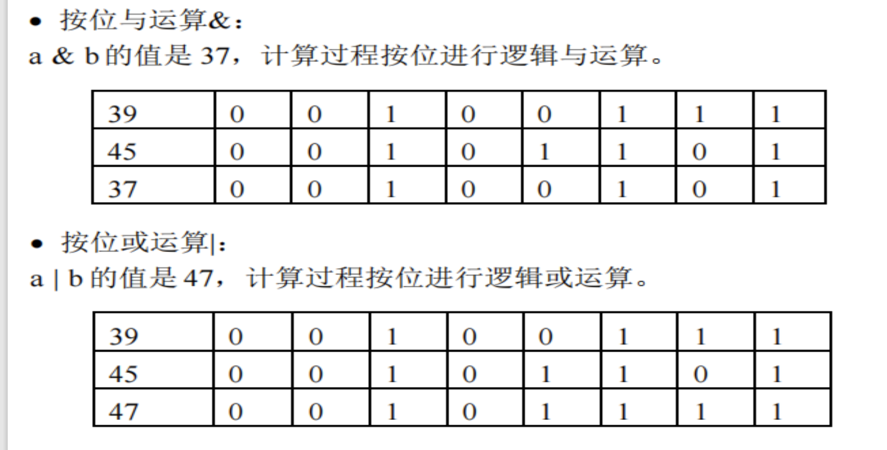
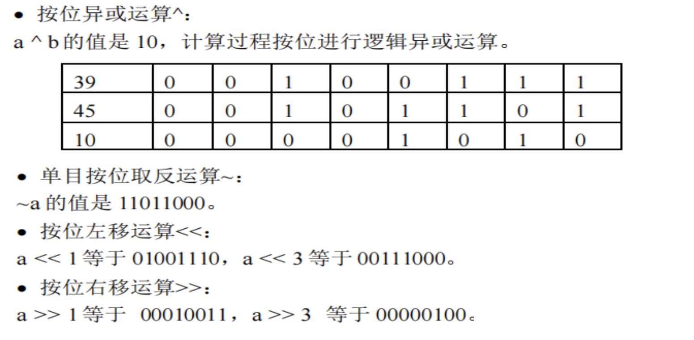
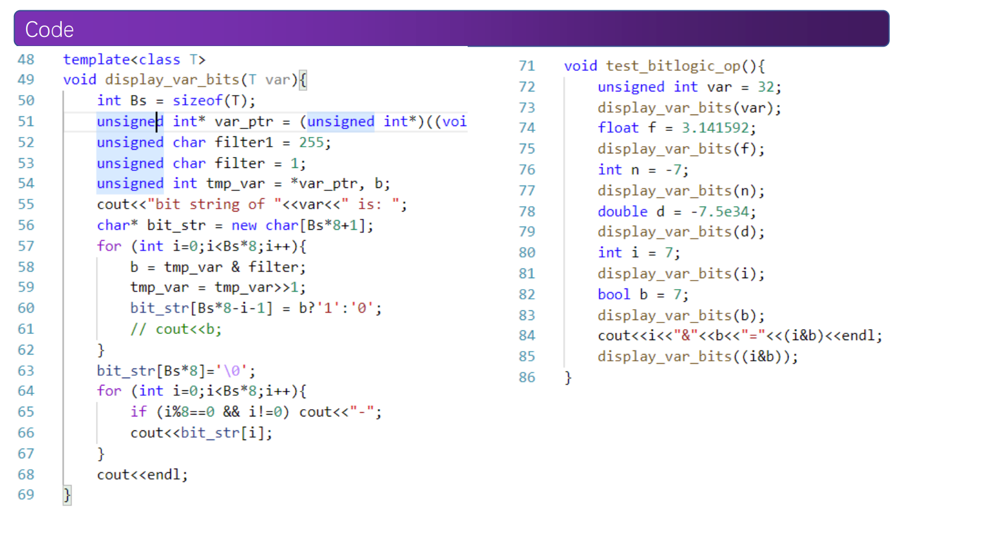
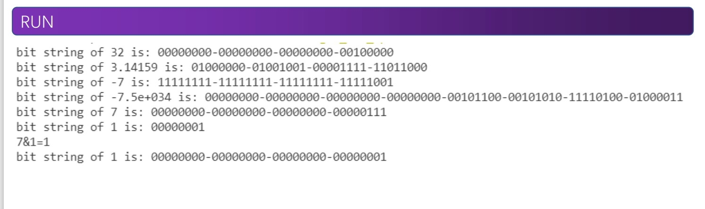

# C++中的符号
## 基本符号
#### ASCII表
- 计算机本身不能直接区分不同的字母、数字或特殊符号，它是根据每个符号对应的编码来识别这些基本符号的。这些符号的编码表称为ASCII码表。
- ASCII 是美国标准信息交换码（American Standard Code for Information Interchange）的英文缩写，ASCII 码表把 95 个基本（可打印）符号和 33 个控制字符共 128 个字符与 7 位二进制数 0000000～1111111 共 128 个数码建立了对应关系，实际上任何一个基本符号在计算机内的表示形式就是这样一个二进制数码。
---

---
- 计算机的基本存储单元是字节，一个字节有 8 个二进制位，一般一个基本字符的代码存为一个字节。一个ASCII码只需要8位存储，通常被存储为无符号的char类型。
- 一个ASCII码和一个整型数是一一对应的，每一个字符唯一对应一个整型数，可以参与整型运算。
- 从 032～126 共 95 个可打印字符构成了基本字符集。
- 用 8 位编码可表示 256 个字符，在不同的计算机中有不同的扩展 ASCII 码表，在扩展的 ASCII 码表中，128～255 号字符一般是不同语言的特殊字符、特殊制表符、及其他特殊符号。在许多高级语言（如 Basic、C）的书中，可以找到扩展的 ASCII 码表，其中扩展部分只供读者参考，因为其符号与编码的对应可能不是唯一的。
---
## 字面常量
- C++程序中的常量是指固定不变的量，有两种表示形式：一种称为有名常量，一种称为字面常量（literal constant）。例如圆周率float pai=3.1416，其中 pai就是一个有名常量，pai是量 3.1416 的名字，而 3.1416 称为字面常量。
- 字面常量中的量可看作是C++中的数据，而表示该量的名可看作是C++中的符号。
- 字面常量分为 4 类：int 型常量、float 型常量、char 型常量和字符串常量。字面常量是我们可以输入程序的量，简单来说，如果我们想给程序输入内容，只能是这4种类型的量。
```
#include<iostream>
using namespace std;
int main()
{
  cout<<"Hello World!"<<endl;
  return 0;
}
  for(chicken=0;chicken<100;chicken+=3)
    for(hen=0;hen<=33;hen++)
      if((cocl=100-chicken-hen)>1)
```

```
#include<iostream>
using namespace std;
int main()
{
  int myage;
  cout<<"My age is ";
  cin>>myage;//一个整数
}
```

#### 整型
- C++中的整型指的是可以精确表示的整数，其对应于数学中的自然数集合，但是受限于位宽，整型的表示范围通常有限。
- 整型不只可以表示整数，还可以表示离散的状态等等。因此，C++中将整型进一步划分为以下类型：
  - int
  - bool
  - char
  - enum
  - pointer
  - ……
- int 型又称整型。是最常用最基本的数据类型。
  - **范围**：原则上是所有整数，实际的值集为计算机所能表示的所有整数。这个范围是有限的，因此程序员在编程时必须经常考虑因数据过大而溢出的问题。
  - **存储**：占用的存储空间按不同的计算机和编译系统而有所差别，目前在PC 机上运行的各种 C++语言规定 int型数据占用 4 B即 32 bit 空间。
  - **运算**：int 型数据允许算术运算、关系运算等许多种运算。
- char 型又称字符型，即把单个字符作为一种数据处理。
- char 型的值集是全部基本字符、ASCII 码集或扩充的 ASCII 码集对应的全部符号。
- char 型的数据占用**1 B即 8 bit**空间。
- 在作为数字计算的时候，char 型数据与低位宽的 int 型等价，因此可参加的运算相当广泛。
- 字符集可与单字节整数有完整的对应关系（ASCII 码），因此还可把 char 型看做是可以用来表示单字节整数的字符型。
- bool 型在新版的 C++语言中被列为基本类型，它只有两个值：false、true，表示逻辑的真和假，可参加逻辑运算和作为逻辑表达式及关系表达式的结果。bool型的存储空间为**1B，即8bit**。
- bool只能参与逻辑运算。
- bool本身只有0/1两种表示，实际上只需要1bit存储就可以了，为什么在C++中也要将bool存储为8bit的值呢？
- void 型称为无值型。void 型是一种较为抽象的概念，在 C++语言中它用来说明函数及其参数，没有返回值的函数说明为 void 类型的函数，没有参数的函数其形参表由void 表示。
- 有了 void 类型，C++语言规定，所有函数说明（main 函数除外）都必须指明（返回）类型，都必须包含参数说明
---
#### 浮点型
- C++中的浮点型对应于数学中的实数类型，因此在许多书和编程语言中浮点又被称为实数型。但是受限于表示位宽，浮点的表示范围和精度通常有限。
- C++中实现了IEEE754标准的浮点类型：
  - double
  - float
- 浮点表示通常是不精确的，比如1.3这个实数通常难以在计算机中获得精确的1.3的表示，因此对浮点数做操作时，通常用作数学计算，不做条件判定。
- float 型又称浮点型，它对应着数学中的实数概念，带小数点的数。
- float 型的值集，原则上是任意大小和精度的小数，实际的值集虽然不可能是任意大小，但由于采用尾数+阶码的表示形式，所以其可表示浮点数的范围可大到**±3.4*10^38** , 表示的精度可以小到**1.0*10^-38**。因此，在一般的应用问题中，float 型数据总是可以满足精度和大小的要求，不会出现溢出现象。
- float 型数据一般占用 **4 B**，即 **32 bit** 空间。当精度较高或数值较大时，人们往往使用 double型（占用 **8 B**，即 **64 bit** 空间）。
- float 型数据与 int 型数据的区别在于它们所参加的运算操作类型是不同的。比如增减量运算（++，––），条件判断等语句中。
---

---
#### 字符型
- char 常量即字符常量，如：'A'、'g'、'3'、'!。C++语言还定义了一些特殊的字符常量，全是用反斜杠“＼”开头的，如下(要记住)

---
#### 字符串型
- 字符串常量是用双引号括起来的字符序列，称为字符串常量。比如"string constant"。
```
#include<iostream>
using namespace std;
int main()
{
  int radius=4;
  float pai=3.1415926535;
  float weight=6.9e4;
  const char*str="Hello World! \nHello China! \0 Hello Nankai\n"
  cout<<"radius="<<radius<<"\n pai= "<<pai<<"\n weight="<<weight<<"g\n";
  cout<<str<<endl;
  return 0;
}
```
## 运算符
- **运算符与表达式**的概念，来源于数学，计算机却看不懂这些符号，让计算机完成一个表达式的计算，还需要编写一系列的指令。
- 表达式由运算分量和运算符按一定规则组成，其中的运算符指明所进行运算的类型，运算分量可以是常量、变量或表达式，单个的常量或变量也是一个表达式。
- 按参加某一类运算的运算分量的个数，运算分为单目运算、双目运算以及三目、多目运算。
- 运算符（operator）主要由字母、数字之外的第 3 类基本符号组成，少数的例外是个别关键字，如 **sizeof、new、delete**，也被列入运算符之列，其余运算符为：


---
- 运算符的概念和用法来自数学，不过在 C++语言中运算符和运算的概念对于人们日常
习惯的理解已有所扩展。例如，在 C++语言中，赋值（“=”），表达式的并列（<表
达式>，<表达式>），a［i］中表示下标的[]都一律作为运算和运算符来处理。
- **注意：符号运算的优先级将在后面讲解**
---
#### 赋值运算
- 一类运算是一个运算类型，具有相同运算分量和结果类型的运算划分为同一类。比如
**赋值运算、算术运算、关系运算、逻辑运算、位运算**等。
- **赋值运算**是一种双目运算，其形式为：<变量名>=<表达式>
  - “=”为赋值运算符（与数学中的等号含义不同）。
  - **左运算分量为与表达式类型相同的变量**。（左值和右值）
- 赋值运算的操作为：1,计算表达式的值；2,把该值赋给左端变量
- 除赋值运算符“=”之外，C++还提供了另外 10 种复合赋值运算符，它们是：
> +=、–=、* =、/=、%=、>>=、<<=、&=、|=、^=，
- 这些符号仅是一种简洁的表示方法。
- **注意赋值运算有返回值，返回值为左值。**
---
#### 运算与运算符类型-赋值运算
```
#include<iostream>
using namespace std;
int main()
{
  int a=1,b=2,c,d;
  d=(c=a+b);
  cout<<"c="<<c<<",d="<<d<<endl;
  return 0;
}
```
run
```
c=3,d=3
```
#### 算术运算
- **算术运算**是指 int 型、float 型（也包括 char 型）的数值类数据计算后，得到同一**类型数据**的运算，包括：
  - 单目的减（–）、增量（++）和减量（––）运算。
  - 双目的加（+）、减（–）、乘（* ）、除（/）和模（%）运算。
- **前缀增量：++<运算分量>；后缀增量：<运算分量>++**运算分量为 int 型（包括char 型）变量，具体操作为令变量值加 1。
- 前增量++i 与后增量 i++的区别在于：如果++i 和 i++作为表达式参加其他运算，则前者是先令 i加 1 然后参加其他运算，而后者则是先令 i参加其他运算，然后再令 i加 1。
- 两个运算分量应为同一类型，如果不同，应该遵循类型转换原则，**即由“短”类型向“长”类型的自动转换**，**即按照: char→int→float→double 的次序进行自动转换。(保证不会溢出)**
```
int a,b;
float x,y;
x=b*a+y;
```
- **两个 int 型数据相除，结果应为 int 型，若商不是整数，也要取整。int 型与float 或double 型相除，结果应为 float 或 double 型**
```
void test_int_div()
{
  int a=3,b=2;
  float y=2.0;
  cout<<"a/b="<<a/b<<",a/y="<<a/y<<endl;
}
```
- 取模运算符%主要应用于整型数值计算。a%b 表示用 b 除 a 所得到的余数。对于整数（int 型和 char 型）来说，除法运算和取模运算有如下关系：a – b *（a / b）== a % b //这里“=”为等号
```
void test_int_mod()
{
  int a=3,b=2;
  cout<<"a-b*(a/b)="<<(a-b*(a/b))<<"\na%b="<<a%b<<endl;
}
```
#### 关系运算
- 关系运算的是计算两个运算分量的值以后对其进行比较，若符合运算符指出的关系，
其结果为 1（true），否则为 0（false）。
- C++提供 6 种关系运算，它们相应的运算符为：<,<=,>,>=,==,!=
- 运算分量应该为**数值类型（或称算术类型）和指针类型**的表达式，**运算符两边类型应该相同，如果不同会启动隐式转换或报错**。
- **运算的结果类型为 bool 型**，也就是逻辑值 false 和true，这两个逻辑值对应于整数0 和 1。
- C++语言中，bool型和 int 型都属于整数类型，bool值 false和 true 同时具有 int 型的值 0和 1，**整数也可以隐式地转换为 bool值：非零整数转换为 true，而 0 转换为 false。**
---
#### 逻辑运算
- 逻辑运算也可以称为bool运算，只对0/1元素进行运算，也是计算机和硬件运算的基本
原理，可以进行逻辑推理。
- C++提供 3 种逻辑运算符：！、&&、||，分别称为逻辑非、逻辑与、逻辑或运算。
- 运算分量应该是**相同的数值（算术）类型或指针类型**的表达式，其运算结果为 bool
（int）型，且只能取 false（0）或 true（1）。
- 逻辑运算是按照真值表进行运算输出的，具体如下：

- 单目运算符非!
```
分量： 0   1
结果： 1   0
```
- 双目运算符与&&
```
分量1 0  1  0  1
分量2 0  0  1  1
结果  0  0  0  1
```
- 双目运算符或||
```
分量1 0  1  0  1
分量2 0  0  1  1
结果  0  1  1  1
```
- 一般逻辑运算（以及关系运算==）的运算分量，**不取浮点类型**，因为在判定浮点数是否为 0 或两值是否相等时容易出错。
---
#### 位运算
- 位运算是高级语言中的“低级”运算，其操作的对象是整型数，要对机器内部二进制
表示的每一位（bit）进行运算。
- 双目位运算符：&、|、
^
、>>、<<
- 单目位运算符：~
- 它们的使用格式为：
```
<运算分量> <双目位运算符&，| 或^> <运算分量>
<运算分量> <双目位运算符>>或<< > <整数 n>
<单目位运算符~> <运算分量>
```
**运算分量为相同的 int 或 char 型及其派生类型**，整数 n 为移位数，**运算结果仍是
整型。**
- 位运算是**按位进行的逻辑运算**，所以其也是根据真值表进行计算输出的，以char a = 
39，b = 45为例，计算结果如下：
---

---
- 位运算是按位进行的逻辑运算，所以其也是根据真值表进行计算输出的，以char a = 
39，b = 45为例，计算结果如下：
---

---

---

---
#### 其他运算符
- C++存在一个唯一的三目运算符：条件运算符，其符号表示为（？和：），其使用格式为：
> <表达式 1>?<表达式 2>:<表达式 3>
- 其意义是：如果**表达式1成立，则返回表达式2，否则返回表达式3**。
- s=(a>b)?a:b等价于如下的语句：
> if (a > b) s = a; else s= b;
- 指针运算符包括**取地址运算符&和值引用运算**符* ，它们都是单目运算符。
- 取地址运算为：& <变量>，返回变量的地址（指针）。
- 这里变量必须是一个**已经说明过的分配过内存的变量名**。
- 值引用运算为：*<指针变量>，返回地址存储的值。指针变量是一个指针变量名。
- 用于函数调用，格式为：<函数名> (<实参表>)
> 例如：add(a，b)、main()等。
- 用于强制类型转换。其格式为：<类型名> (<表达式>) 或 (<类型名> ) <表达式>
> int a = 2，b = 3;
> cout << a / b << " " << float(a)/ b << endl;


