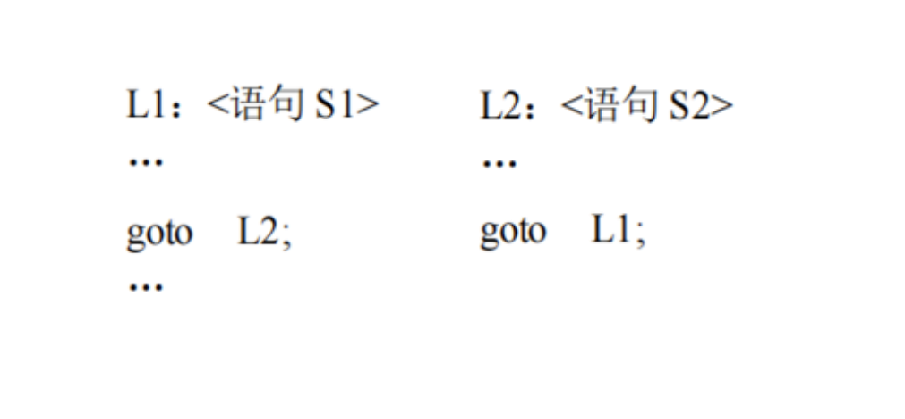

# 深入流程控制语句
## 转向语句
- 转向语句指可以直接控制程序跳转的语句。由于C++程序，默认是按顺序执行和优化的，转向语句打破了顺序执行的规则，给出了可以在程序任意位置进行跳转的能力，可以提升程序灵活性，但是随意使用可能会导致意想不到的错误和性能瓶颈。
- C++语言提供了 4 种无条件转向语句：‘
  - break语句；
  - continue语句；
  - return语句；
  - goto语句。
#### break语句
- **break** 语句又称跳出语句。它用于循环语句和 switch 语句，其功能是把程序的运行流程 跳转到所在的循环语句或 switch 语句的出口。其格式为：
- 仅由一个关键字 break 组成，使用方便，含义也很明确。
---
#### continue语句
- **continue** 语句又称继续语句，是仅用于循环语句中的一种控制语句。其功能是把程序运 行流程跳转到该循环体（不是该循环语句）的出口点，结束循环体的一次重复，其格式为：
- continue 语句和 break 语句类似，虽然都是无条件跳转语句，但其跳转的范围明确，不易产生问题，是推荐使用的无条件转移控制语句。
---
#### return语句
- **return** 语句又称返回语句。只用于函数定义，其功能为：把程序运行的流程跳转到该函数的调用点或函数调用的出口点。计算返回表达式 E 并把其值作为该函数的返回值
- **return** 语句格式为：
> return; 或 return<表达式 E>;
- 表达式 E：当函数的返回类型为 void 型时，返回语句应取第 1 种方式，否则，取第 2种方式。表达式 E 的类型应与函数的（返回）类型相一致。**对于非 void 类型的函数来说，其函数体中的 return 语句是必不可少的**。
---
#### goto语句
- **goto 语句**又称转向语句，其功能是令程序跳转到程序指定的某标号语句处。由于标号语句的设置较为灵活，因此，goto 语句的跳转控制比上面 3 种跳转语句有较大的随意性。其格式为：
> goto <标号>;
- 标号是一个标识符，其定义出现在标号语句： <标号>：<语句>
- 语句goto L2;把控制流程跳转到 L2：<语句 S2>，
- 语句 goto L1;又跳转到 L1：<语句 S1>。
- 标号语句可以出现在转向它的 goto 语句之后，也可以出现在其之前。goto语句和 break、continue、return 语句都是无条件转移语句，无需任何判断，程序执行到此时，必须跳转到一个确定的位置。
---

---
- **goto语句**转向的目标位置由程序员任意确定，而 break、continue 和return 语句的转向目标位置由其本身的位置所决定。然而，goto语句的转向目标——标号语句的位置虽然可由程序员确定，但不是完全任意的，它应满足下面的限制：
  - 一个**函数定义（函数体）内的 goto 语句不可转到函数之外**。换句话说，函数的出口点只能是 return 语句或函数体结束。
  -  一个**块语句（包括函数体和循环体）外的 goto 语句不可转到该程序块之内**，因为这往往会产生计算机难于处理的局面。
- 基于goto语句可以实现任意的程序控制代码，包括但不限于分支语句、循环语句、转向语句等等，基于goto几乎可以实现任意你想要实现的流程控制。
- 即使有这样的限制，goto 语句仍然是十分自由的，goto 语句的使用容易造成：
  - **使程序的静态结构与程序的动态结构差别增大，使程序段之间形成“交叉”的关系，不利于程序的维护和调试。**
  - 一个好的程序，它的各个程序段最好是单入口单出口的，没有死循环和死区（不可到达的程序段）。但 goto 语句的使用容易破坏这种状态。
  - 历史上关于 goto 语句的讨论是程序设计和软件开发史上的重大事件之一，由“goto 语 句是有害的”这样一篇著名论文引起，最终以“限制使用 goto 语句”作为结论，从而对软件开发的发展产生了重要影响。 因此，建议不用或少用 goto 语句。
- 可以把goto语句理解为瞬间转移特技，或者火影里的飞雷神，只要事在任何地方放上一个坐标，**程序执行时就可以任意跳转**（当然还是有规则限制），将导致不可预知的错误。
## 课后习题
- 寻找小于n的素数——Bramble‘sApplessushu.cpp
- 排序去重——Bramble‘sApplessort.cpp
- 改死锁——Bramble‘sApplesdream.cpp
- 约瑟夫环——Bramble‘sApplesround.cpp

