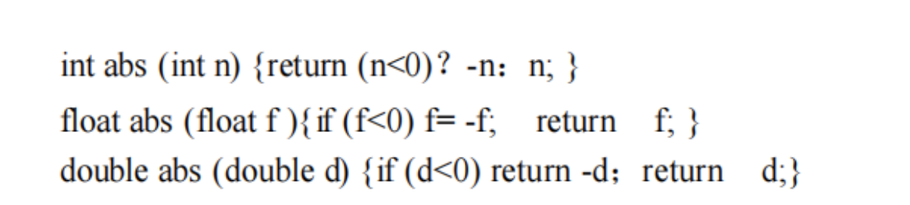

# 函数重载与运算符重载
## 函数重载
#### 函数重载定义
- **对若干种不同的数据类型求和，虽然数据本身差别很大**（例如整数求和、向量求和、矩阵求和），具体的求和操作差别也很大，但**完成不同求和操作的函数却可以取相同的名字**（例如 sum、add 等）。
- 许多差别很大的打印函数可以都用同一个函数名 print，显示函数可以都用 display，从键盘或文件获取信息都称作 get，发送称为 send，接收称为 receive 等。
- 函数重载是指在同一个作用域内，可以定义多个具有**相同名称**但**参数列表（参数类型、参数个数或参数顺序）不同**的函数。函数重载使得程序可以根据不同的参数列表选择合适的函数进行调用，从而提高代码的灵活性和可复用性。
--- 

---
- 函数名的重载并不是为了节省标识符（标识符的数量是足够的），而是为了方便程序员的使用。
- 实现函数的重载必须满足下列条件之一：
  - **参数表中对应的参数类型不同。**
  - **参数表中参数个数不同。**
  - **参数表中不同类型参数的次序不同。**
- **注意：返回类型不同是不能区分重载函数的。**
- 

