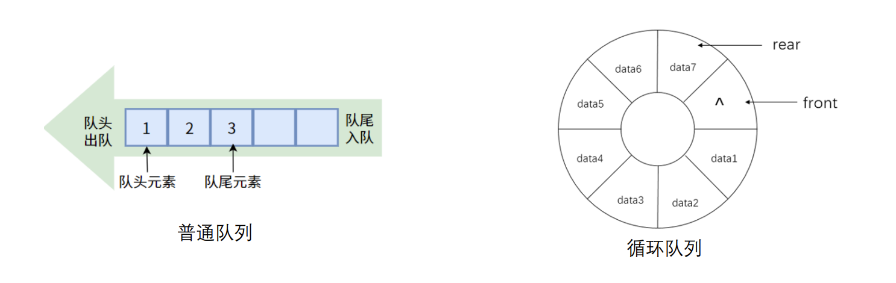

# C++自定义类型探索
## 自定义类型
#### 枚举
- enum 类型又称枚举类型，它是一种由用户参与定义的类型。
- 申明格式为：
> enum<enum 类型名>{<枚举值表>}<枚举变量表>;
- enum 类型实际上是 int 型的一个子集，其每一个值对应一个整数。
- n 个枚举值全未赋常量值时，自左至右分别与整数 0～n–1对应。
- 若第 i 个枚举值赋的常量值为整数 m，则其未赋常量值的后续枚举值分别与整数m+1、m+2，…对应，直到下一个赋了值的枚举值或结束。因此，为枚举值所赋的整型常量值应自左至右递增。
- 枚举类型变量只能赋予其值表中的值，且不能直接赋予数值。
- 枚举类型的说明亦可作为成组说明若干整型符号常量的方法。它不是完全由用户定义的。
- --

---
#### 联合
- 联合构建了一系列数据成员的组合，但是所有数据成员重叠，都从同一位置开始存储。
- 通常也只在要描述一批可重叠存放的数据成员时才使用联合 union。例如都是整型的多个数据，比如int和char[4]的联合。
- 不同编码的数据联合可能会产生意外的结果，比如int和float的联合体。
- --

---
#### 结构
- **数组是把若干相同类型的数据放在一起，结构则是把若干不同类型的数据放在一起。**
- 例如，一个公司雇员的数据可能包括：名字，性别，工资，电话。可以定义为一个结构体表示。 C++语言中的结构是作为类似于类的概念处理的，但是其概念上只是不同数据的联合体，不包含函数或属性，但是在C++支持给结构体定义函数。
---

---
- 结构类型说明的格式为：
> struct <类型名> { <成员表> };
- 成员表：<类型> <成员 1>;<类型> <成员 2>;...;<类型> <成员 n>; 可以看出成员表就是变量申明的列表。
- 结构类型的变量说明的格式为：
> [struct] <结构类型名> <变量名表>;
- **struct关键字在申明变量时可以省略（和枚举类型一样），也可以在申明结构体的同时申明变量，变量名表与一般变量说明一样，赋初始值的方法同数据的赋初值方式。**
---

---
- 对结构类型的分量的存取由圆点运算符“.”实现，因此，为结构变量赋值，除了在变量说明中赋初值（如为 gy4 赋初值）的方法外，还可以用赋值语句或其他方式为**结构分量赋值**的方法：
- 无论采用哪种方法为结构分量赋值，都必须保证类型一致，比如上例中的字符串赋值在最新的C++编译器中会出错，提示不能用常量字符串赋值char数组。
---

---
- 特别的，在以往版本中的C++编译器还允许直接对结构变量赋值，但是值得注意的是，这里的赋值在新版本中被更新为对赋值运算符=的重载。
---

---
- 此外，这个输出符号<<也是重载过的，具体重载如下。
---

---
- **结构类型的数据也可以组成数组**，称为结构数组。结构数组在许多实际应用问题中经常用到，例如，通讯录、学生成绩单、商业销售记录、人事档案、资料登记表等。
---

---
- 在C语言中，只是将结构体作为一种存放数据的实体来使用的。
- 在C++中，类和结构在一定意义上是等价的，同样能够像类那样实现封装，即除数据成员外，也可在结构中定义函数成员。结构也可以有它自己的构造函数、析构函数以及this 指针等。
- 结构与类的区别是：在缺省情况下，结构的成员是公有的（隐含为 public 属性），而类的成员是私有的（隐含为 private 属性）。
- 一般情况下，使用结构来“封装”若干数据的集合，而当既描述数据成员又刻画其操作（函数成员）时则使用类class。
- 在讨论结构的时候，一般用结构变量这个词；但在讨论类时，则用对象这个词。
---
#### 类和对象
- 一个类说明的常用格式为：
```
class <自定义类类型名> { 
private: 
<各私有成员说明>; 
protected:
<各保护成员说明> ;
public: 
<各公有成员说明>; 
};
```
- private 关键字后列出本类的私有成员，protected关键字列出本类的保护乘员，public 关键字后列出本类的公有成员。
- private ，protected与 public 的顺序可以任意排列；每一个类型的控制属性均可以出现多次或者一次也不出现；**若紧随左花括号后的第一个控制属性为 private，则该private 关键字可以省略（也就是说默认成员为private）。**
- 只可在本类中对类的private成员进行访问，在别处是“不可见的”。
> a.private_attr=0;
- 类的protected成员可以在其派生类中访问和继承，但是不可被类外访问。
> a.protected_attr=0;
- 类的public成员不仅在类中可以访问，而且在建立类对象的其他模块中，也可以通过对象来访问。
> a.public_attr=0;
- 成员又区分为**数据成员与函数成员（也称成员函数**）两种。数据成员代表该类对象含有的数据，描述的是该类对象的属性；而函数成员则代表如何对该类对象所含数据进行操作的代码，描述的是对该类对象的处理方法。
> a.public_attr
> a.public_func()
- 类所含有的成员函数既可放于**类定义体的花括号**之中，也可按**类体外定义的方式放于花括号之外进行说明**（放在类体外说明时，**类内必须有其函数原型**，且类外函数说明的前面必须用“**<类名>::**”来限定）。
```
class A{
public: void func();
}
void A::func(){}
```
- 按如下方式来说明对象（即该类的变量或称该类的实例）：
> <自定义类类型名> <对象名 1>, … ,<对象名 n>；
- 注意，若在该类的说明中含有带参数的构造函数，则在说明对象的同时，要给出具体实参初始化该对象（参看 7.3 一节内容）。此时说明对象的方式应改为：
> <自定义类类型名> <对象名 1> ( <实参表 1> )， … ，<对象名 n> ( <实参表 n> );
- 与其他变量及结构变量类似，也可以说明**类对象的数组**（数组分量为对象）以及**指向对象的指针**。另外，对象还可进行如下的操作与使用：
  - **同类型的对象间可以相互赋值；**
  - **对象可作为函数参数**（如，对象作形参，对象指针作函数参数等）；
  - **函数的返回值可以是对象**（或指向对象的指针）；
  - 可以在一个类中**说明其他类的对象作为其数据成员**等。
- 按如下方式来使用对象的成员（数据成员或函数成员）：
> <对象名>.<成员名>
- 如果是一个指向对象的指针，我们可以使用如下两种方式来调用对象的成员：
> *<指针>.<对象名> 或者 <指针>-><对象名>
---
## 预定义类型
#### 字符串
- 普通字符串：
---

---
- String字符串类型：
---

---
#### 链表
- 此前我们已经知道了数组是一种线性的结构，其由相同的元素组成的一系列的值。字符串是一种特殊的字符数组。
- 与之对应的链表是一种线性数据结构，它由一系列节点构成，每个节点包含数据和一个指向下一个节点的指针。
- **链表中的节点可以在内存中任意位置，而不像数组一样需要连续的内存空间。**
- 在C++中，链表是一种数据结构，由一系列节点组成，每个节点包含对序列中下一个节点的引用。
- 允许在列表中有效地插入和删除元素，以及向前或向后遍历列表。
- 要在C++中实现链表，需要使用指针来跟踪列表中的节点之间的连接。
- 链表的基本结构十分简单，一般由多个节点node组成，每个节点包含数据部分以及指向其他节点的指针：
---

---
- 要创建链表，首先需要创建一系列node节点对象，然后使用它们的next指针将它们连接在一起。以下是如何使用三个节点创建链表的示例：
- --

---
- 链表的形式多种多样，通常可分为三类：
  - 单向链表
  - 双向链表
  - 循环链表
---

---
#### 单向链表
- 单向链表，指的是有开始和结束位置，并且只有一个指向后继或者前驱指针的链表。
- 单向链表的基本操作包括**遍历、插入、删除**和**反转**等操作。
- 链表的遍历操作是指依次访问链表中的每个节点，可以使用一个指针从头节点开始依次访问下一个节点，直到指针为空（即遍历到了链表的末尾）。链表的遍历操作的时间复杂度为O(n)，其中n是链表的长度。
---

---
- 定义节点
```
class Node {
public:
int data;
Node* next;
Node(int val) : data(val), next(nullptr) {}
};
// 全局变量，头指针
Node* head = nullptr
;
```
- 插入操作
```
// 链表插入函数
void insertNode
(int val) {
Node* newNode = new Node(val);
if (head == nullptr) {
head = newNode
;
} else
{
newNode
->next = head;
head = newNode
;
}
}
```
- 遍历节点
```
void traverseList() {
Node* current = head;
while (current != nullptr) {
std::cout << current->data << " ";
current = current->next;
}
std::cout << std::endl;
}
```
- 删除节点
```
void deleteNode(int val) {
if (head == nullptr) {
return;
}
if (head->data == val) {
Node* temp = head;
head = head->next;
delete temp;
return;
}
Node* current = head;
while (current->next != nullptr && current->next->data != 
val) {
current = current->next;
}
if (current->next != nullptr) {
Node* temp = current->next;
current->next = temp->next;
delete temp;
}
}

```
- 链表反转
```
void reverseList() {
Node* prev = nullptr
;
Node* current = head;
Node* next = nullptr
;
while (current != nullptr) {
next = current
->next;
current
->next = prev
;
prev = current;
current = next;
}
head = prev
;
}
int main() {
insertNode
(
5);
insertNode
(10);
insertNode
(15);
insertNode
(20);
std::cout << "Original list: "
;
traverseList();
deleteNode
(10);
std::cout << "List after deleting 10: "
;
traverseList();
reverseList();
std::cout << "Reversed list: "
;
traverseList();
return
0
;
}
```
- output
```
Original list: 20 15 10 5 
List after deleting 10: 20 15 5 
Reversed list: 5 15 20
```
---
#### 双向链表
- 定义节点
```
class Node {
public:
int data;
Node* pre;
Node* next;
Node(int val) : data(val), next(nullptr) {}
};
// 全局变量，头指针
Node* head = nullptr;
Node* head->pre = nullptr;
Node* head->next = nullptr
```
---
#### 循环链表
- 定义节点
```
class Node {
public:
int data; 
Node* next;
Node(int val) : data(val), next(nullptr) {}
};
// 全局变量，头指针
Node* start = nullptr;
Node* head->next = nullptr;
int main(){
Node n1,n2,n3; 
n1.data = 1;
n2.data = 2;
n3.data = 3;
n1.next = &n2;
n2.next = &n3;
n3.next = &n1;
return 0;
}
```
---
#### 堆栈
- 堆栈是计算机中最常用的数据结构，比如在我们之前的函数调用章节，我们说过，转移之前需要进行参数和状态的压栈和出栈。
- 堆栈的基本操作是压栈和出栈，其只在栈顶操作元素，遵循先入后出的原则，只需要指向栈顶的指针。
- 堆栈的容量通常是有限的，不过在数据结构中可以实现动态或者静态容量的堆栈。
---

---
- 堆栈的基本操作包括压入、弹出、容量动态增长、堆栈容量等。
- 堆栈定义和初始化：
---

---
- 压栈操作：
```
void push(struct Stack
* stack, int value) {
// 容量动态增长
if (stack
->head == stack
->capacity 
-
1) {
int newCapacity = stack
->capacity * 
2
;
int* pre = stack
->data;
stack
->data = new int
[newCapacity];
// copy and delete
for
(int
i = 
0; 
i < stack
->capacity; ++i) {
stack
->data[
i] = pre[i];
}
delete[] pre;
stack
->capacity = newCapacity
;
}
stack
->data[++stack
->head] = value;
}
```
- 出栈操作
```
int pop(struct Stack* stack) {
if (stack->head == -1) {
std::cout<<"Stack is empty.\n";
return -1;
}
return stack->data[stack->head--];
}
int main() {
struct Stack stack;
initialize(&stack);
push(&stack, 5);
push(&stack, 10);
push(&stack, 15);
push(&stack, 20);
printf("Stack size: %d\n", size(&stack));
printf("Pop: %d\n", pop(&stack));
printf("Stack size after pop: %d\n", size(&stack));
cleanup(&stack);
return 0;
}
```
- output
```
Stack size: 4
Pop: 20
Stack size after pop: 3
```
---
#### 队列
- 队列是计算机中最常用的数据结构，其基本操作为入队列和出队列，遵循**先入先出**的原则，保留队首和队尾指针，通常用于消息队列等
- 堆栈的容量通常是有限的，不过在数据结构中可以实现动态或者静态容量的队列，此外循环队列也是常见的队列类型。
---

---


