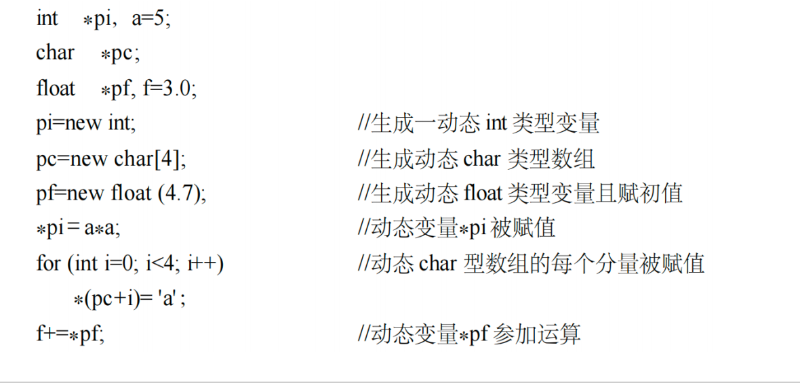
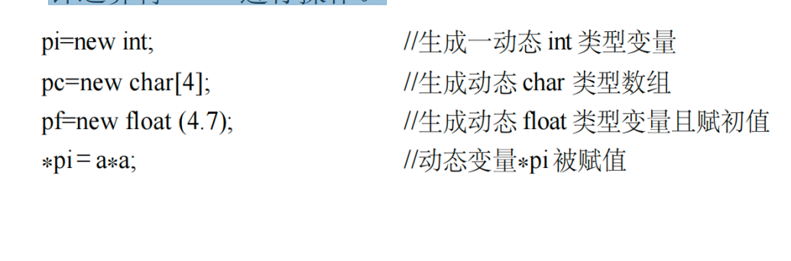

# 指针与动态内存管理
## 动态内存分配
#### 动态内存分配符
- new运算是程序中除了变量说明之外，又一种生成变量的方法。
- new生成的变量为**无名动态变量**，它返回的是一个该类型的指针值，程序通过指针对这个变量进行操作。
---

---
- 用new生成的一个动态变量与用变量说明语句说明的一个变量作比较：
- 都要指出变量的类型，类型名要放在 new 之后。
- 都可以赋初值，不是用“=<初值>”的方式而是用括号“(<初值>)”的方式。
- 都可以说明为数组，加数组运算符[ ]。
- 动态变量没有变量名，为**无名动态变量**，需用指针变量接收到它的地址后，通过指针运算符“*”进行操作。
---

---
#### 动态内存释放符
- delete运算用来撤销或释放由 new 生成的动态变量，例如：
  - delete pi; //释放 pi指向的动态 int 变量
  - delete pf; //释放 pf 指向的动态 float 变量
  - delete [] pc; //释放 pc 指向的动态数组
- **动态变量与一般变量的主要区别就是它可以在程序运行过程中任意被撤销**。而一般变量则必须在其所说明的程序块结束时自动撤销。
- 也就是说，**动态变量与一般变量的生存期和作用域非常不同**。
---
#### 动态内存分配与释放
- 动态内存分配指：使用运算符 new和 delete，通过指针引用，可以在程序的任何地方进行内存的分配和释放。例如：
```
int *pint; char *pchar; float *pfloat;
pfloat = new float; pchar = new char; pint = new int;
```
- 这样就生成了 3 个（浮点型、字符型、整型）变量，但它们没有名字。由于 3 个变量的地址 分别存在指针 pfloat、pchar 和 pint，故在程序中使用这 3 个变量时，都通过指针：
> *pchar = ‘A‘; *pint = 5; *pfloat = 4.7; *pint++;
- 当不再需要指针所指向的这些变量时，可在程序的任何地方释放掉它们：
> delete pchar; delete pint; delete pfloat;
- **注意：这里释放的是动态的（char、int、float）变量，而不是指针变量（pchar、pint、pfloat）**。
- 在使用动态变量时应注意的是要保护动态变量的地址，比如在释放或者保存前一个动态变量的地址后，在更改指针的值。例如：
> pi=new int;
- 不要轻易地更改指针 pi 中的值，如果未保留pi的值，又执行了 pi=&a; 语句之后，那么原来的值就再也找不回来了！！！这时候再释放pi就出错了，因为a不是动态变量，而原来生成的动态变量则面临无法释放的尴尬局面：
> pi=&a; delete pi;
- 如果很多这样的变量不释放，就会导致内存越用越多，最后死机。此外这种未释放的动态变量还可能导致内存泄漏等安全问题。
- C++还保留了从C 语言中继承下来的用于动态存储分配的**malloc( )、free( )等标准函数**，它们已经可以被 new 和 delete 运算所取代。
## 指针与访存越界
#### 指针内存占用
- 指针变量也是变量，需要分配内存空间进行存储，即使是空指针也要占用内存空间。
- 在32位程序下，指针变量通常占用4B内存空间，这是因为32位程序的地址空间不超过32位，即4B。
- 相应地，在64位程序，指针变量通常占用8B内存空间，即64位。
- 指针指向的内存空间大小，通常不是由指针变量决定，而由变量本身决定：
  - int型占用4B;
  - char型变量占用1B;
  - double型变量占用8B;
  - 自定义类型则通过计算获得。
- 当指针指向连续的地址空间时，比如数组首地址或者数组的某一个元素，其指向的内存空间大小则由数组元素以及数量决定，不是由指针变量决定：
  - new int[4]返回具有4x4B=16B内存空间的访问首地址。
  - new double[8]返回具有8x8B=64B内存空间的访问首地址。
- 计算指针指向的内存占用通常由程序员来统计和确认，C++不提供验证。
---
#### 访存越界检测与避免
- 由于C++本身不保证内存访问的正确性验证，这导致C++中指针访问的内存越界是非常常见的。
- 内存越界会导致严重的安全问题和内存泄漏问题。当访问不安全的内存，会导致程序出错，甚至系统错误，获得错误结果。
- C++中没有内置内存访问越界的检测和避免策略，仅凭程序员自己确定内存访问的安全性与正确性。
- 避免访存越界和内存泄漏需要尽量做到几个原则：
  - 使用安全的C++函数库和类库；
  - 谁分配谁释放原则；
  - 使用静态分析工具与内存检测工具。
---
#### 智能指针
- 普通指针，使用时要记得释放内存
```
{
  int*p=new int[100];
  ……//
  delete p;//要记得释放内存

}
```
- 独占指针std::unique_ptr，指针自动管理内存。
```
{
std::unique_ptr<int> uptr = std::make_unique<int>(200);
//...
// 离开 uptr 的作用域的时候自动释放内存
}
```
- std::shared_ptr对资源做引用计数，当引用计数为 0 的时候，自动释放资源。
```
{
std::shared_ptr<int> sptr = std::make_shared<int>(200);
assert(sptr.use_count() == 1); // 此时引用计数为 1
{ 
std::shared_ptr<int> sptr1 = sptr;
assert(sptr.get() == sptr1.get());
assert(sptr.use_count() == 2); // sptr 和 sptr1 共享资源，引用计数为 2
} 
assert(sptr.use_count() == 1); // sptr1 已经释放
}
```
# 课后习题
- 亚波人的阴谋——stack.cpp
- 希卡利的数据库——link.cpp
- 艾斯的肉联厂——pointerfunction.cpp
- 诸星团的吉普车——snack.cpp


