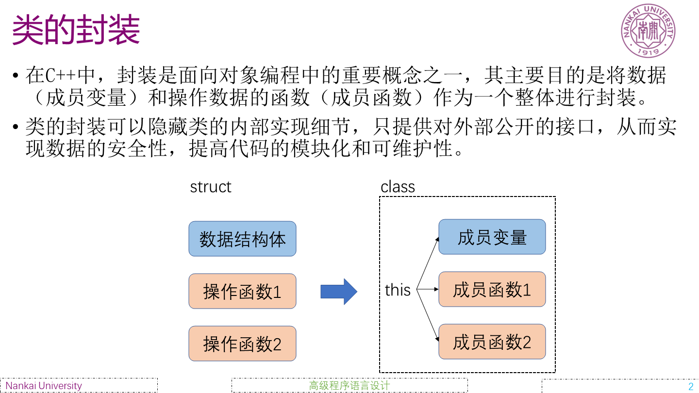

# 课程内容

相比较于C语言中结构体对于数据的单一支持，C++中提供了class的概念，可以将数据和操作数据的方法封装成类，使得数据更加灵活、易于管理。

简单来说，不论是用用户自定义的类，还是C++提供的类，其目的都是建立一种抽象的数据结构用来统一描述数据的各种属性和操作，对于数据的一般性操作都可以通过调用类中的方法来实现。

# 实验题目

* 学生类的定义
该题题目要求使用学生类来管理学生的语文，英语，计算机成绩，并且输出每个学生的成绩平均值。

* 计算体积的类
该题目要求定义一个类，用来计算三维空间中的体积，要求提供两个方法：
1. 计算体积的函数
2. 计算体积的体积积分函数

* 动态数组
该题目要求定义一个动态数组类，要求提供两个方法：
1. 动态数组的构造函数
2. 动态数组的插入函数
只需要提供pushback函数用于向动态数组中插入元素，并且提供index函数用于删除指定位置的元素。

* 面向对象和结构的Tensor
 这里是该课程第一次引入tensor的概念，tensor本质上一个高维张量，我们在第一次接触时，可以使用降维的方式将高维tensor表示为一维向量，然后使用步长数组统计每个维度下子维度元素的个数，这样就能够方便的使用向量坐标来访问指定的原苏联，使用面向对象的tensor只需要构造ndim,shape,stride等数组即可。