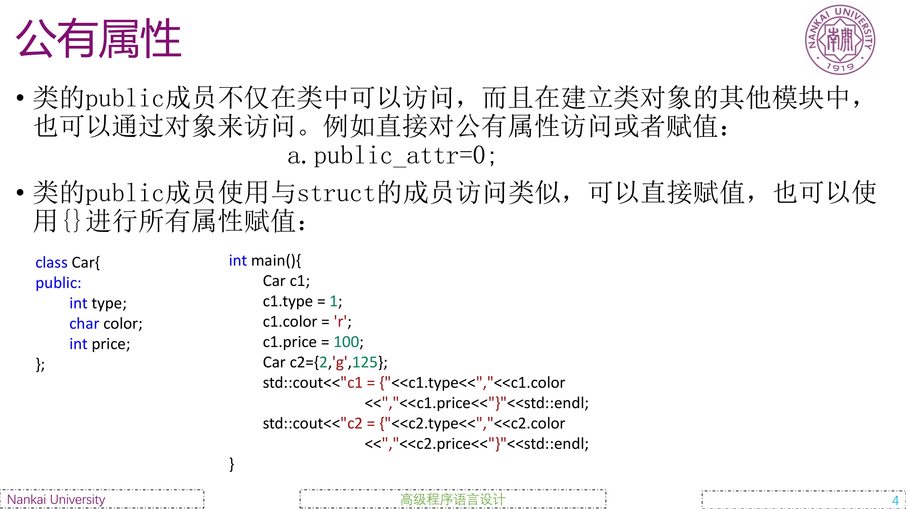
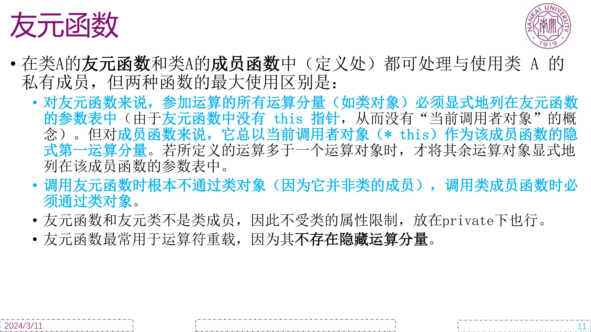
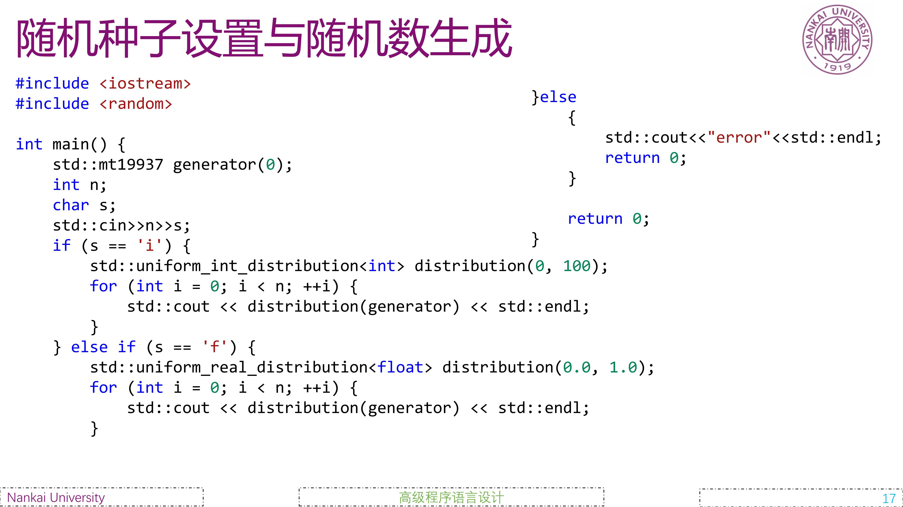
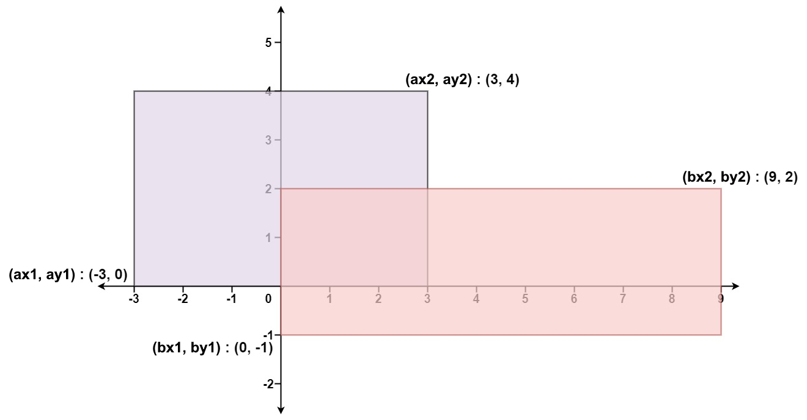

# 课程内容

## 访问权限

本节课程聚焦于类的成员的属性。相比于结构体，类封装得更加完善，默认权限为私有权限，也就是一个类中的成员一般是不允许外界访问的。类就像张名片，对外接口权限为public,这是外界可以看见并且访问的。而对内的接口为private，这是只有内部可以看见并访问的。而protect权限则是对内和子类可见，但是对外不可见。

一般我们将类中的数据权限设置为private,对外提供public的接口方法，将构造函数和析构函数也设置为public，方便主程序创建和销毁对象，不过也有将构造函数私有化的设计模式，这种设计模式被称为工厂模式，这里我们不予介绍。

## 友元

除此之外，世界上的任何事物都不是绝对的，对于类的私有权限成员我们也可以通过友元的方式提供一种特定的渠道来访问。

## 随机数生成

接着上节课我们完成的tensor数据结构，如果需要大量的实验数据，使用随机数生成器是一个非常快速且理想的方法。
需要导入``#include <random>``头文件，然后使用随机数生成种子``std::mt19937``指定一个种子``gen`` 使用分布将随机产生的数字映射到指定区间内。

# 实验题目

## addTensor
这题要求重载+运算符，实现两个同维tensor的加法，构造出一维存储的tensor，逐位相加即可。
> 其实不同维度tensor可以采用切片的方法相加

## pointAndLine

由数学知识如果直线方程为$Ax+By+C=0$那么点$(x_0,y_0)$在直线上的等价条件为$Ax_0+By_0+C=0$，否则就不在直线上，可以根据具体值来判断是在点的上方还是下方。

在``Point``类和``Line``中声明一个友元函数，该函数判断一个点和一个直线的关系即可。

### pointDistance
两点间距离公式，同样声明友元函数即可
``    friend void distance(const Point &point1, const Point &point2);``

## rectangleOverlappingArea
计算矩形重叠面积

取左下点的最大值，右上点的最大值，这样就是重叠面积。