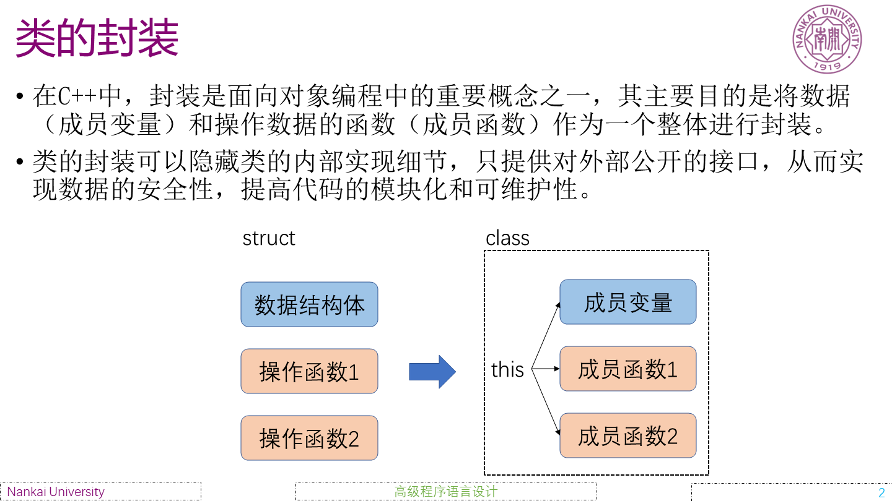

# C++高级语言程序设计 2-2 实验课

## 课程简介

在当今数字化的时代，软件的高效开发和可靠运行至关重要。C++作为一种强大的编程语言，广泛应用于系统软件、游戏开发、科学计算等众多领域。
本课程《C++高级语言程序设计 2-2》深入探讨 C++的高级特性，旨在帮助学生提升编程能力，为解决复杂的实际问题打下坚实的基础。
以下从四个方面介绍本课程。
#### 学习动机
 - 满足专业发展需求：对于计算机科学、软件工程等专业的学生来说，掌握 C++高级特性是提升专业竞争力的关键。
 - 应对复杂项目挑战：在实际开发中，经常会遇到需要高效、灵活和可维护的代码的情况，C++的高级特性能够提供解决方案。

#### 学习挑战
 - 概念理解难度大：如多态性、模板等概念较为抽象，需要深入理解和不断实践才能掌握。
 - 代码实现复杂：涉及到复杂的语法和编程技巧，容易出现错误，需要仔细调试和优化。

#### 学习目标
 - 深入理解 C++的高级特性，包括数据封装、多态性、模板等。
 - 能够运用这些特性进行高效、可靠的程序设计。
 - 培养良好的编程习惯和代码风格，提高代码的可维护性和可扩展性。

#### 学习效果
 - 支撑学科：计算机科学、软件工程、信息技术等相关学科。
 - 可做事情：开发复杂的软件系统、游戏开发、科学计算、数据库应用等。能够参与大型项目的开发，为解决实际问题提供有效的技术支持。

## 课程内容列表

1. **数据封装**
   - 类的成员变量和成员函数
     - 介绍如何在类中定义成员变量和成员函数，以及它们的作用和访问权限。
   - 访问控制修饰符
     - public、private、protected 的含义和用法，以及如何实现信息隐藏。
2. **存取控制**
   - 成员函数的访问权限
     - 不同访问权限的成员函数对类的外部和内部的可见性。
   - 友元函数和友元类
     - 介绍友元的概念和用法，以及在什么情况下需要使用友元。
3. **构造与析构函数**
   - 构造函数的作用和种类
     - 默认构造函数、带参数的构造函数、拷贝构造函数等的定义和使用。
   - 析构函数的作用和执行时机
     - 介绍析构函数在对象销毁时的作用，以及如何正确处理资源释放。
4. **函数重载**
   - 函数重载的概念和规则
     - 介绍如何通过函数重载实现同名函数的不同行为。
   - 函数重载的实现原理
     - 编译器如何区分不同的重载函数。
5. **类的特殊成员**
   - 静态成员变量和静态成员函数
     - 介绍静态成员的特点和用法，以及如何实现类的全局数据和函数。
   - 常量成员函数
     - 介绍常量成员函数的作用和使用方法，以及如何保证成员函数不修改对象的状态。
6. **引用和拷贝构造函数**
   - 引用的概念和用法
     - 介绍引用的定义、初始化和使用，以及引用与指针的区别。
   - 拷贝构造函数的作用和实现
     - 介绍拷贝构造函数在对象复制时的作用，以及如何正确实现拷贝构造函数以避免资源泄漏。
7. **运算符重载**
   - 运算符重载的概念和规则
     - 介绍如何通过运算符重载实现自定义类型的运算符行为。
   - 常见运算符的重载
     - 如加法运算符、赋值运算符等的重载方法。
8. **继承和复合**
   - 继承的概念和种类
     - 介绍单继承和多继承的概念和用法，以及继承的优缺点。
   - 复合的概念和用法
     - 介绍如何通过组合多个类来实现更复杂的功能。
9. **多态性与虚函数**
   - 多态性的概念和实现方式
     - 介绍静态多态和动态多态的概念和实现方法。
   - 虚函数的作用和实现
     - 介绍虚函数在实现动态多态中的关键作用，以及如何正确使用虚函数。
10. **模板与泛型编程**
   - 函数模板
     - 介绍函数模板的定义和使用，以及如何实现通用的函数功能。
   - 类模板
     - 介绍类模板的定义和使用，以及如何实现通用的类功能。
11. **标准类库**
   - 标准输入输出流
     - 介绍如何使用标准输入输出流进行数据的输入和输出。
   - 容器类
     - 介绍常见的容器类如向量、列表、映射等的用法。
   - 算法库
     - 介绍标准算法库中的常见算法，如排序、查找等的用法。

## 图片和表格示意

**C++高级特性概述列表**

|特性|描述|
|----|----|
|数据封装|将数据和操作封装在类中，实现信息隐藏。|
|存取控制|通过访问修饰符控制对类成员的访问。|
|构造与析构函数|用于对象的初始化和资源释放。|
|函数重载|实现同名函数的不同行为。|
|类的特殊成员|包括静态成员和常量成员函数等。|
|引用和拷贝构造函数|正确处理对象的引用和复制。|
|运算符重载|自定义类型的运算符行为。|
|继承和复合|实现代码复用和功能扩展。|
|多态性与虚函数|实现动态多态，提高代码的灵活性。|
|模板与泛型编程|实现通用的代码，提高代码的可重用性。|
|标准类库|提供丰富的功能，简化编程。|

**C++数据封装示例**

